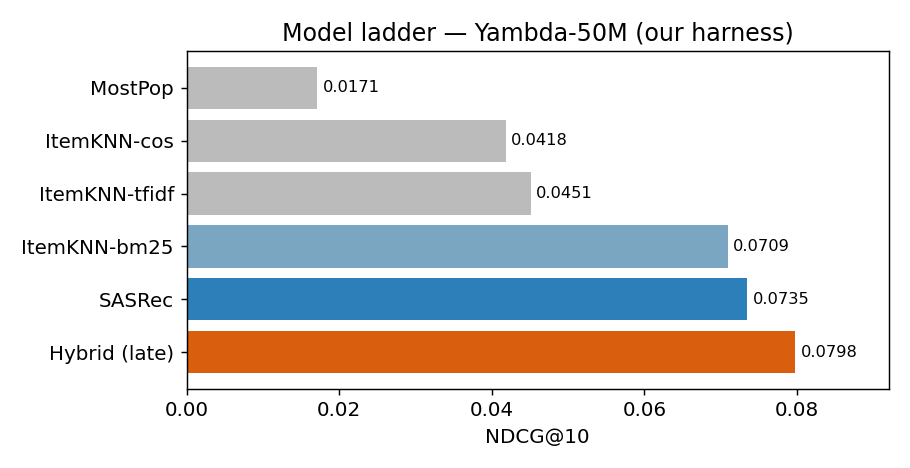
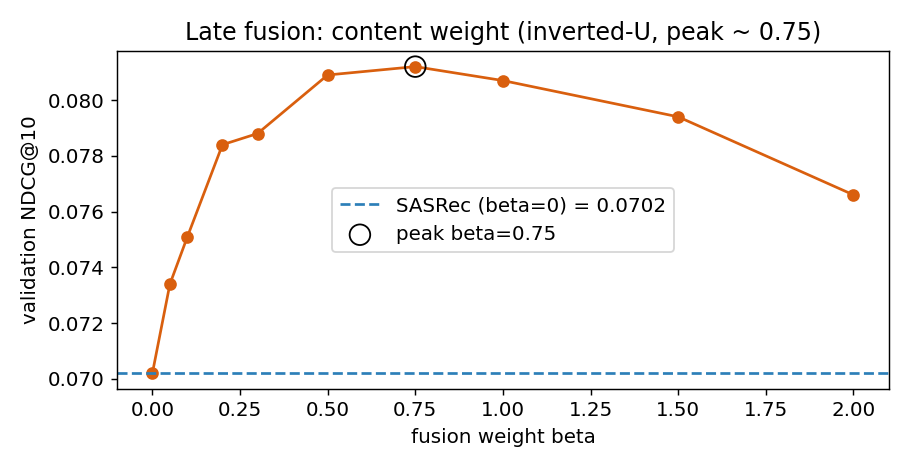
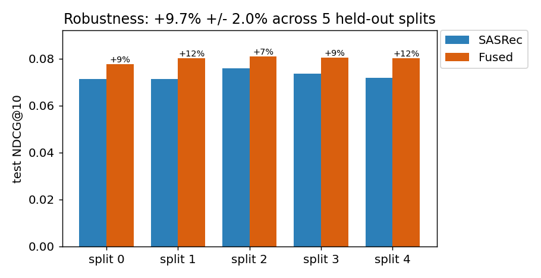
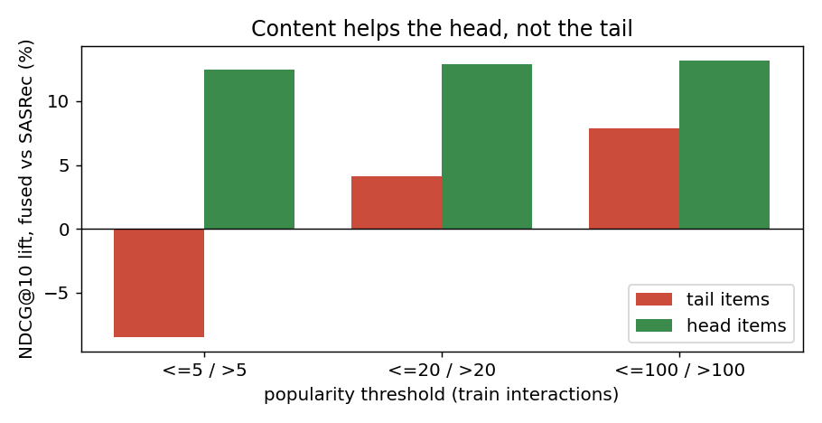

# Next-Gen Music Recommender on Yambda — Technical Report

**Team:** Anna Grishkina · Valeria Karpova · Aleksey Kosychev
**Course:** HSE Master's · NNDL · Representation Learning
**Dataset:** [Yambda](https://huggingface.co/datasets/yandex/yambda) (Yandex Music, arXiv:2505.22238, RecSys '25)
**Code:** https://github.com/ak1232320/nndl_capstone_2026

---

## TL;DR

We build a next-track recommender on real Yandex Music logs and evaluate it under
the dataset's official protocol. A **SASRec** sequence model beats every published
baseline and reproduces the paper to **98 %**. A **late-fusion hybrid** that adds
an audio-content score lifts NDCG@10 by a **robust +9.7 % ± 2.0 %** over SASRec
across 5 held-out user splits. A tail analysis shows the audio gain comes from
**mainstream tracks, not the long tail** — overturning our initial cold-start
hypothesis and giving an honest account of *why* the hybrid works.

| Model | NDCG@10 | Note |
|-------|---------|------|
| MostPop | 0.0171 | popularity |
| ItemKNN (bm25) | 0.0709 | strongest classical baseline |
| **SASRec** | **0.0735** | beats all baselines; 98 % of paper (0.0748) |
| Hybrid — joint embedding fusion | 0.0581 | overfit → negative result |
| **Hybrid — late fusion** | **0.0798** | **+9.7 % ± 2.0 %** over SASRec (5 splits) |

---

## 1. Problem

Given a user's listening history, predict the next track they will actually want
to hear — the decision a streaming product makes for every active user, every few
minutes. In a saturated market where subscriber growth has plateaued, the quality
of this ranking is the lever on listening time and churn. We target a measurable
improvement in offline next-track ranking.

## 2. Data

**Yambda** is a production listening log from Yandex Music. The full release has
4.79 B events / 1 M users / 9.39 M tracks; we use the official **50M** slice (the
right size for a single free GPU while preserving all real-world structure and
matching the published baselines).

After our preprocessing (see §4):

| Quantity | Value |
|----------|-------|
| Raw listen events (50M) | 46,467,212 |
| Listen+ events (played ≥ 50 %) | 29,439,278 |
| Train Listen+ (after GTS split) | 29,285,498 |
| Test Listen+ (1-day window) | 152,899 |
| Item vocabulary (distinct train items) | 629,373 |
| Evaluated users (have train history) | 4,549 |
| Audio embedding dim | 128 |
| Audio coverage of our vocab | 94.6 % (595,237 items) |

**Signal layers used.** Implicit feedback (plays with played-ratio), and the 128-d
precomputed audio embeddings. Every event also carries an `is_organic` flag
(user-driven vs recommender-driven) — a debiasing handle most public datasets lack.

**Real-world operational data** from a production company → qualifies for the +2 bonus.

## 3. Models

**Baselines.** MostPop (global popularity) and ItemKNN (item-based kNN via
`implicit`, cosine / tfidf / bm25 weightings).

**SASRec** (sequence tower). A causal-attention Transformer over the user's
Listen+ history (structurally a small GPT): item + positional embeddings, 2
self-attention blocks (d = 64, 1 head, dropout 0.2, maxlen 200), trained with the
original BCE + one-negative-per-position objective for 120 epochs.

**Audio-content tower.** A training-free content score: the user is the **mean
audio embedding of their history** (a "taste centroid"), items are scored by
audio dot-product. It can score any item with an audio vector.

**Fusion — the key design decision.**
- *Joint embedding fusion (failed).* We first folded content into the item
  embedding, `v_j = e_j + α·ContentMLP(audio_j)`, trained end-to-end. It **overfit**
  (train loss fell below SASRec's while test NDCG dropped to 0.0581): joint
  training lets the content branch memorise training transitions and dilute the
  collaborative signal. The learned α stayed high (~1.18), i.e. the optimiser
  *wanted* content because it helped *training* — the textbook overfit signature.
- *Late (score-level) fusion (won).* Keep SASRec frozen and combine standardised
  scores: `score(u,j) = zscore_j(SASRec) + β · zscore_j(content)`, with **β chosen
  on a validation split of users** (not on train). β = 0 recovers SASRec, so
  fusion *cannot* do worse; β is selected for generalisation, not memorisation.

## 4. Evaluation protocol

We follow the dataset's **Global Temporal Split (GTS)**: 300 days train, a 30-min
gap, a 1-day test window; user state frozen at the test start; users with no train
history discarded. A **Listen+** positive is a play of ≥ 50 % of the track. We
report **NDCG / Recall / Coverage @10 and @100**, ranking over the **full 629 k-item
catalogue** (no sampled negatives) — so absolute values are small by design.

Two implementation notes that proved important:
- **IDs are sparse** in a large space (uid up to 1e6, item_id up to 9.39e6 with
  only ~10 k / 934 k present) → remapped to dense indices before any matrix /
  embedding.
- **Seen items are never filtered.** Re-listening is real in music; filtering
  already-heard tracks collapses every model (MostPop 0.0171 → 0.0033, ItemKNN
  cosine 0.0418 → 0.0048).

**Harness validation.** Our numbers line up with the paper's, so comparisons are trustworthy:

| Model | NDCG@10 (ours) | NDCG@10 (paper) | ratio |
|-------|----------------|-----------------|-------|
| MostPop | 0.0171 | 0.0186 | 0.92 |
| ItemKNN (bm25) | 0.0709 | 0.0781 | 0.91 |
| SASRec | 0.0735 | 0.0748 | **0.98** |

SASRec reproduces the paper to 98 %, so the harness ≈ Yandex's; the ~9 % gap on
ItemKNN is undertuning (we used K = 100), not a protocol difference.

## 5. Results

### 5.1 Model ladder (our harness, NDCG@10)

| Model | NDCG@10 | NDCG@100 | Recall@100 |
|-------|---------|----------|------------|
| MostPop | 0.0171 | 0.0229 | 0.0353 |
| ItemKNN — cosine | 0.0418 | 0.0738 | 0.1246 |
| ItemKNN — tfidf | 0.0451 | 0.0786 | 0.1337 |
| ItemKNN — bm25 | 0.0709 | 0.1020 | 0.1609 |
| **SASRec** | **0.0735** | 0.1005 | 0.1517 |
| Hybrid — joint fusion | 0.0581 | 0.0908 | 0.1510 |
| **Hybrid — late fusion** | **0.0798** | — | — |

BM25 is the clear best classical weighting; SASRec beats all baselines.

### 5.2 Fusion weight β (validation NDCG@10, one split)

| β | 0.0 | 0.05 | 0.1 | 0.2 | 0.3 | 0.5 | **0.75** | 1.0 | 1.5 | 2.0 |
|---|-----|------|-----|-----|-----|-----|----------|-----|-----|-----|
| NDCG@10 | .0702 | .0734 | .0751 | .0784 | .0788 | .0809 | **.0812** | .0807 | .0794 | .0766 |

A clean inverted-U peaking at β ≈ 0.75 — the content adds genuine complementary
signal (the optimum is not at β = 0).

### 5.3 Robustness (5 held-out user splits)

| seed | β | SASRec | Fused | lift |
|------|---|--------|-------|------|
| 0 | 1.00 | 0.0712 | 0.0776 | +9.1 % |
| 1 | 0.75 | 0.0714 | 0.0802 | +12.3 % |
| 2 | 1.00 | 0.0759 | 0.0809 | +6.6 % |
| 3 | 0.75 | 0.0737 | 0.0804 | +9.1 % |
| 4 | 1.00 | 0.0718 | 0.0801 | +11.5 % |
| **mean** | — | **0.0728 ± 0.0018** | **0.0798 ± 0.0011** | **+9.7 % ± 2.0 %** |

Every split is positive; the win is not an artefact of one split. On the held-out
test users, all metrics improve (Recall@10 +11 %, NDCG@100 +11.5 %, Coverage@10 +15 %).

### 5.4 Where the gain comes from (tail analysis, β = 0.75)

Each user's relevant test items are split by train popularity; recommendations are
full-catalogue, we just credit hits per slice.

| slice | users | SASRec | Fused | lift |
|-------|-------|--------|-------|------|
| head > 5 | 4444 | 0.0691 | 0.0777 | **+12.5 %** |
| tail ≤ 5 | 3069 | 0.0134 | 0.0122 | **−8.5 %** |
| head > 20 | 4256 | 0.0605 | 0.0683 | +12.9 % |
| tail ≤ 20 | 3853 | 0.0279 | 0.0290 | +4.1 % |
| head > 100 | 3714 | 0.0467 | 0.0529 | +13.2 % |
| tail ≤ 100 | 4361 | 0.0471 | 0.0508 | +7.9 % |

The audio gain concentrates on **popular** items (+12–13 %) and slightly **hurts**
the extreme tail (−8.5 % on items with ≤ 5 interactions).

## 6. Discussion

**The audio signal is taste-alignment, not cold-start rescue.** Our user vector is
the *mean* audio of the history — a taste centroid that boosts sonically-central
(typically mainstream) tracks. It refines ranking on the head, but does not rescue
rare items, and can even demote a genuine long-tail next-track by pulling mass
toward audio-central items. This *overturns* the intuition in our pitch that
content would fix cold-start, and is, we think, the more interesting finding: the
benefit is real and robust, but its mechanism is different from the textbook story.

**Why late fusion beat joint fusion.** Joint training optimises a single train
loss, so a high-capacity content branch is rewarded for memorising training
transitions — it overfits. Late fusion selects the content weight by *validation*
NDCG, so it adds content only to the extent it generalises (β ≈ 0.75–1.0, never the
overfit regime). The contrast — same audio signal, opposite outcome — is the core
modelling lesson.

## 7. Reproducibility

Everything is a pip-installable package (`ymrec`) driven by thin Kaggle notebooks
that install it from GitHub. One free Kaggle T4 (16 GB) suffices; data and audio
embeddings stream from Hugging Face in ~1–2 min.

| Notebook | Produces |
|----------|----------|
| `00_kaggle_smoke` | harness sanity check (MostPop) |
| `01_baselines` | MostPop + ItemKNN ladder |
| `02_sasrec` | SASRec (0.0735) |
| `03_content_emb_prep` | filtered audio embeddings (optional) |
| `04_hybrid` | joint-fusion negative result |
| `05_fusion` | late fusion + β tuning |
| `06_robustness` | multi-seed robustness + tail analysis |
| `07_report_figures` | the figures in this report |

## 8. Conclusion & future work

On real Yandex listening data we built a reproducible pipeline whose SASRec beats
every published baseline (98 % of the paper) and whose late-fusion hybrid adds a
**robust +9.7 % ± 2.0 %** NDCG@10 — backed by an honest account of *why*. Natural
next steps: a **retrieval-oriented content design** (audio similarity to the most
recent tracks rather than a global centroid) to target the long tail; richer
fusion (per-user or per-cohort β); and scaling to the 500M slice.

## References

1. Kang & McAuley, *Self-Attentive Sequential Recommendation* (SASRec), ICDM 2018.
2. Yandex, *Yambda-5B — A Large-Scale Multi-modal Dataset for Ranking and Retrieval*, arXiv:2505.22238, RecSys 2025.
